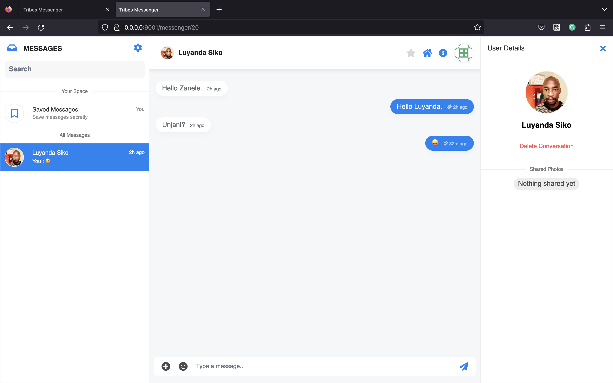

# Tribes Messenger #

**Tribes Messenger** is a Laravel based application written to showcase development 
skills with the said ***Framework***. The application leverages **TailwindCss** for 
*styling* and utalizes **Laravel Blade** as a **Templating Engine**. 

## Prerequiites ##

- PHP v8.1+
- Node v18
- NPM v9
- Docker

## Installation Instruction(s) ##

- Clone this repository into your working directory, for example, `/var/www/html/{your-app-directory}`
- Change directory into the `src` directory of your app

Once inside the said directory run the commands below:

```cli
┌─[MacBook-Pro][~/devhouse/assessments/tribes-messenger/src]
└──╼ cp .env.example .env
```

Once we have done copying the `.env` file successfully, we need to build our **JavaScript** before 
we boot up our services.

```cli
┌─[MacBook-Pro][~/devhouse/assessments/tribes-messenger/src]
└──╼ npm install && npm run dev
```

> The codebase includes an `.nvm` file that specifies the **Node** versions we 
> would like to use. This is useful if you switch inbetween different versions of **Node**.

At this point we have laid down the foundation of our **Application**.

Using **Docker**, we will move one directory up and execute `docker-compose up -d --build`. 
This command will build all our services that we need to have our application run.

```cli
┌─[MacBook-Pro][~/devhouse/assessments/tribes-messenger]
└──╼ docker-compose ps
          Name                         Command               State                       Ports
-------------------------------------------------------------------------------------------------------------------
tribes-app                  docker-php-entrypoint php-fpm    Up      9000/tcp
tribes-dbadmin              /docker-entrypoint.sh apac ...   Up      0.0.0.0:9004->80/tcp
tribes-nginx                /docker-entrypoint.sh ngin ...   Up      0.0.0.0:9001->80/tcp
tribes-rdbms                docker-entrypoint.sh mysqld      Up      0.0.0.0:9002->3306/tcp, 33060/tcp
tribes-realtime-messaging   node /app/bin/server.js start    Up      0.0.0.0:6001->6001/tcp, 0.0.0.0:9601->9601/tcp
tribes-smtp                 MailHog                          Up      0.0.0.0:8025->1025/tcp, 0.0.0.0:9005->8025/tcp

```

Once all services are `up`, we need to get into the application container and install our **PHP** depencencies 
and finish off installation process.

```cli
┌─[MacBook-Pro][~/devhouse/assessments/tribes-messenger]
└──╼ docker exec -it tribes-app bash
```

Inside the container we need to run the following commands:

```cli
┌─[MacBook-Pro][~/devhouse/assessments/tribes-messenger]
└──╼ composer install && php artisan migrate
```

## Packaged Services ##

- Relational Database Server (MySQL 8)
- Database Administrator System (PhpMyAdmin)
- NGINX (PHP Backend Server)
- Soketi Web Socket Server
- MailHog (Email Client)

> The **Soketi** service replaces **Pusher** to allow for offline testing during development.

## Screenshots ##

**Application Screenshots**




**Services Screenshots**


